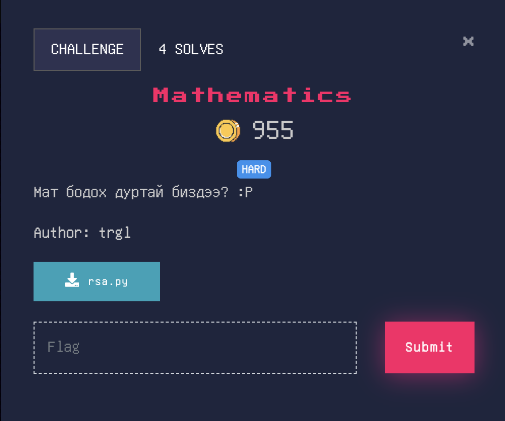

# Mathematics

RSA algorithm-ийн `p`, `q` анхны тоонуудыг олоход тайлагдаж болдог.
- $p*q$ -ийн утга өгсөн.
- $(p+q)^2 * (p-q)^2$ = $2p^2 + 2q^2$ -ийн утга өгсөн.

`p`, `q`-г олох:
- $4*(p*q)^2 + 2p^2 + 2q^2$ = $2*(p+q)^2$ -> энэнээс $p+q$ -ийн утгыг олж болох бөгөөд тэрнээсээ $p-q$ -ийг өгөгдсөн `Problem` утгаас гаргаж авна.
- $(p+q)+(p-q)=2p$, $(p+q)-(p-q)=2q$ гэж `p`, `q`-г олно.

[Solution Code](./sol.py)

- Flag : nest{R1v3st_sh4MIr_ad1emaN_:P}
