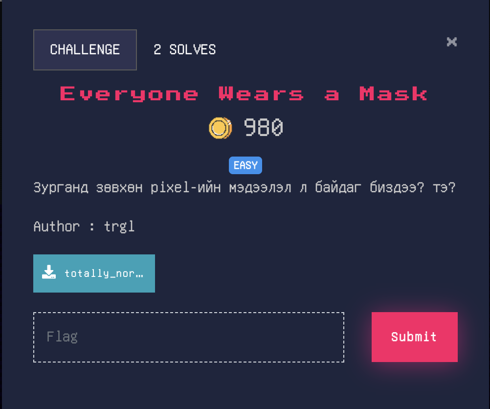
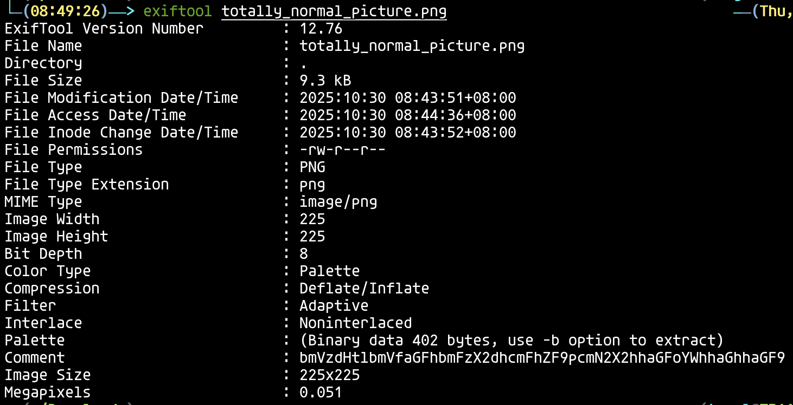
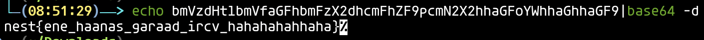

# Everyone Wears a Mask

Өгөгдсөн зургийг онгойлгон үзэхэд онцгой юм харагдахгүй.

Харин `exiftool` коммандыг ашиглаад зургийн `metadata`-г шалган үзье.

`Comment` хэсэг дээр энгийнээс өөр зүйл ажиглан үүнийгээ `Base64`-өөр тайлна.

- Flag : nest{ene_haanas_garaad_ircv_hahahahahhaha}