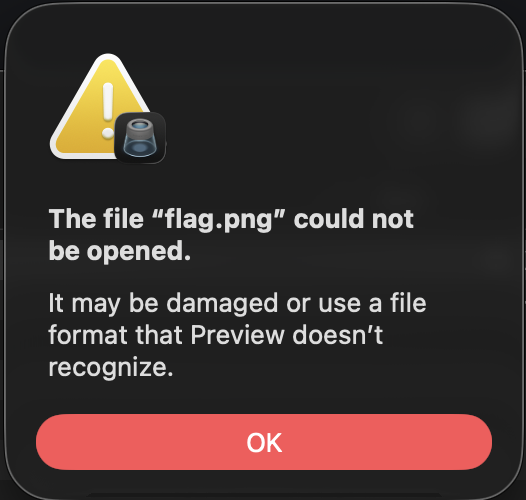
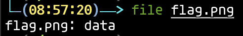
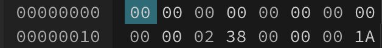
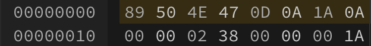

# Headhunter

Өгсөн зургийг нээж болохгүй байна.

`file` коммандыг ашиглан шалгаж үзэхэд зүгээр л `data` гэж таниж байна. Тийм учраас `file`-ийг таних [File Signature](https://en.wikipedia.org/wiki/List_of_file_signatures) устгагдсан гэсэн үг.

Зургийг [Hex Editor](https://hexed.it/) дээр нээн `Magic Byte`-уудыг `.png` өргөтгөлтэй файлын `Magic Byte` болох `89 50 4e 47 0d 0a 1a 0a` болгон янзалъя.

Янзалсан зургаа нээж үзэхэд `flag` гарч ирнэ.

- Flag : nest{t0_b3_4_f1L3_0r_n0t_to_be_a_file}