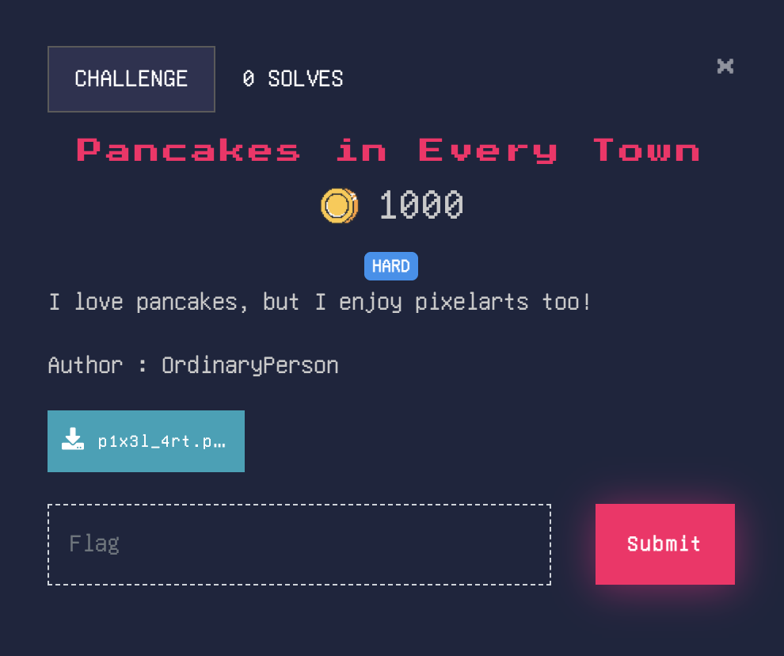
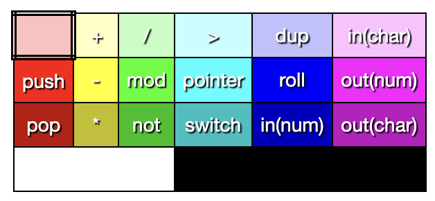

# Pancakes in Every Town

[Piet](https://esolangs.org/wiki/Piet) гэдэг зургаар бичдэг [Esoteric Language](https://en.wikipedia.org/wiki/Esoteric_programming_language).

Зураг нь том болохоор Online compiler-ууд уншуулж чадахгүй, өөрөө логик нь ойлгох хэрэгтэй.

1. Өмнөх өнгөнөөс хамаарч өнгөнүүдийн команнд солигдоно.

2. Хар өнгө хана шиг ажилна.

Ажилах коммандууд:
- 10 block
- 11 block
- push // stack: 10
- push // stack: 11 10
- mult // stack: 110
- out(char) // chr(110) -> n
- .....

Гэх мэтээр явсаар хар хананд тулахад flag бүрэн хэвлэгдэнэ.
- Flag : nest{uzumak!}