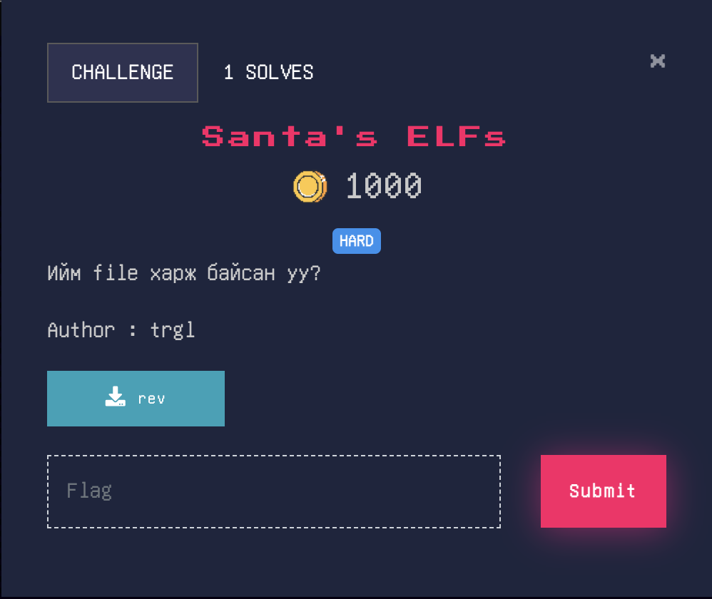
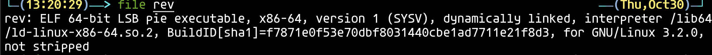
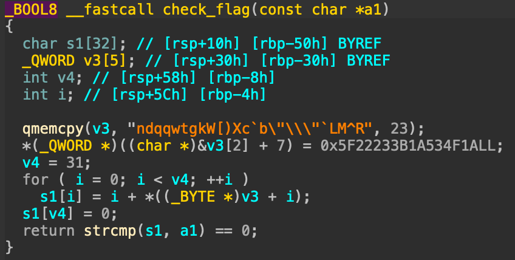

# Santa's ELFs

Өгөгдсөн file-ийг `file` коммандаар харах юм бол, `ELF binary` буюу machine code болгосон `executable` байна.

Decompile хийх хэрэгтэй бөгөөд тэгэхийн тулд:
- Online -> https://dogbolt.org/
- Local -> https://hex-rays.com/

`main()` функц гараас утга авч (Flag), `check_flag()` функцээр дамжуулаад `True` буцаж байвал `Zuv baina.` гэж хэвлэнэ.

`check_flag()` функц өгөгдсөн утгын character болгоны ASCII утга дээр index-ийг нь нэмээд шалгаж байна.

Энэ үйлдлийг хийдэг `script` бичнэ.
[Solution Code](./sol.py)

- Flag : nest{ymr_d3comp1l3r_ash1gl4V??}